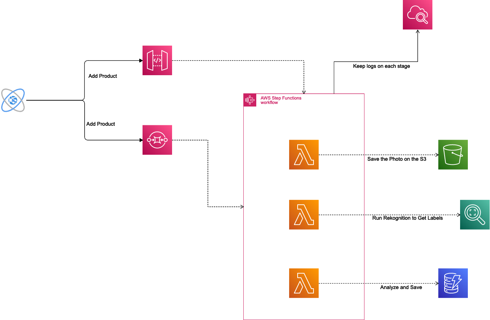
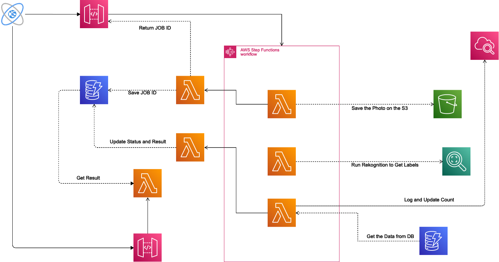

## AWS Architecture Smart Shop

### Description:
This project is plugin which can be included in the different online shoping and will give add the ability to search by image through the products. 

### Demo
Check the link below:
https://danubehomes.s3.us-west-2.amazonaws.com/index.html

### How does it works?

First the crwaler will detect all the products images in the e-commerce ( it can be even feeded through API ) then the Rekognition system will find the lables and collect from a certain confidence and store all of them in the database.

Now, when the user uploads a photo the same processs will happen again. Finding the lables and then matching the lables on the database. Find the best case match through an algorithmes and return to the front-end. 

### Creating Database Architecture:

- The product requests can come from direct API or SQS
- It will trigger the Step Function 
- There 3 major lambda functions
- First it will save the image inside the S3 to be usable for Rekognition.
- Through Rekognition it will extract all the labels. 
- The last one will analyze and extract tags and save the data inside the DynamoDB.

### User Side Architecture

- The client upload the photo for the search 
- Two things will happen: First it will trigger the Step Function and Second it save a tracking (JOB ID) in the database.
- There 3 major lambda functions
- First it will save the image inside the S3 to be usable for Rekognition.
- Through Rekognition it will extract all the labels. 
- The last one will analyze and extract tags and save the result inside the another DynamoDB with the same JOB ID.